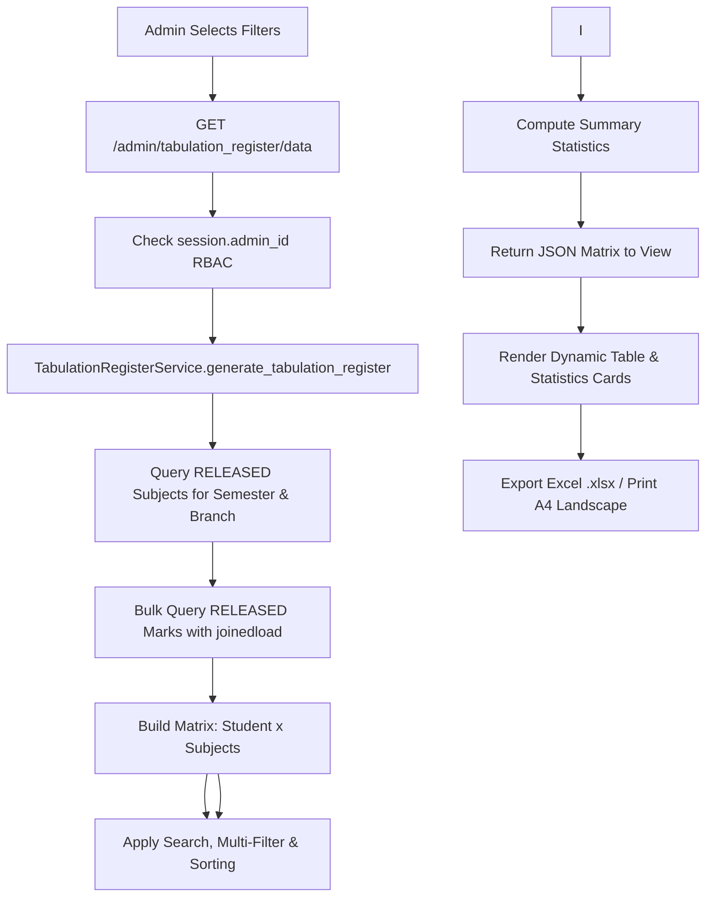
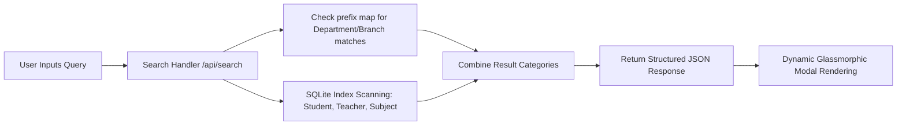
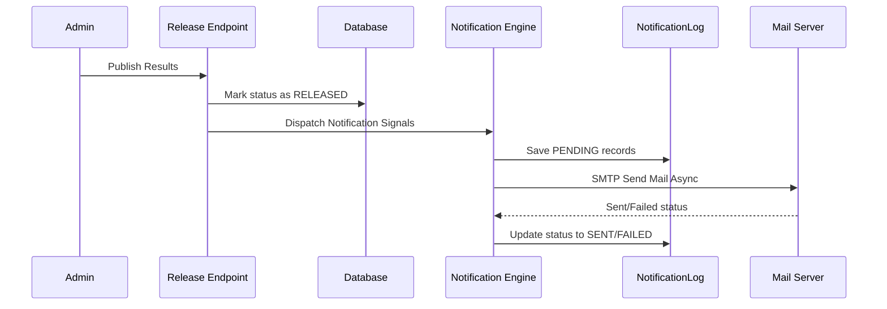

# System Architecture & Workflow

## 🏗️ High-Level Architecture

The system follows a Model-View-Controller (MVC) architectural pattern adapted for modern web applications:

1. **Frontend (View)**: HTML5 templates rendered server-side using Jinja2, styled with Tailwind CSS for high-performance responsive UI design. Interactive components (filtering, searching, matrix sorting, data updates) use Vanilla JavaScript `fetch()` (AJAX) for zero-reload user experience.
2. **Backend (Controller)**: A Python Flask application serving as the orchestration layer to process HTTP endpoints, execute role-based access control (RBAC), compute semester grade point averages (SGPA/CGPA), run validation pipelines, and orchestrate Excel reporting engines.
3. **Services Layer**: Modular service components (`ProcessingService`, `ValidationService`, `SGPAService`, `TabulationRegisterService`, `AnalyticsService`) containing pure domain and business logic decoupled from HTTP controllers.
4. **Database (Model)**: Relational SQLite storage managed via SQLAlchemy ORM modeling core entities (`Admin`, `Teacher`, `Student`, `Subject`, `Mark`, `Result`, `Submission`, `AuditLog`, `ResultRelease`, `NotificationLog`, `SystemSetting`, `SystemActivityLog`).

---

## 🏛️ Tabulation Register (TR) Module Architecture

The Tabulation Register module (`TabulationRegisterService`) provides a dynamic, institutional-grade matrix rendering system for administrators.

### 1. Dynamic Matrix Generation
- **Dynamic Subject Headers**: Scans released subjects for the target cohort and constructs a 2-tier header structure (Tier 1: Subject Code + Title + Credits; Tier 2: Internal | External | Total | Grade).
- **Dynamic Student Rows**: Builds a row per student containing student demographics, per-subject mark entries, and semester aggregate metrics.
- **Support for Any Number of Subjects**: Flexibly expands table columns without requiring schema or code changes.

### 2. Performance Optimization Pipeline
- **N+1 Query Prevention**: Leverages SQLAlchemy `.options(joinedload(Mark.student), joinedload(Mark.subject))` to load all related marks, students, and subjects in a single database round-trip.
- **O(1) Dictionary Lookups**: Constructs in-memory lookups indexed by `(student_id, subject_id)` to generate rows in $O(S \times N)$ linear time where $S$ is subjects count and $N$ is student count.

---

## 🔍 Search & Filter Architecture

The global search and filter pipeline provides rapid, responsive matching across the system.

### 1. Search Logic
- **Indexed SQLite Scanning**: Searches names, roll numbers, batches, subject codes, and emails.
- **Branch and Department Deductions**: Automatically translates textual inputs (e.g. `CSE` or `Mathematics`) into course prefix patterns (e.g. `CS%` or `MA%`) to expand matching subjects.

### 2. UI Filtering
- Filters are saved in the client's session state and applied dynamically to UI listing elements (using Vanilla CSS selectors or live AJAX re-renders) to provide a zero-reload search-and-filter experience.

---

## 📢 Notification Flow

When result publication events happen, notification logs are tracked, and emails are queued for processing.

---

## 🛠️ Error Handling Strategy

### 1. Centralized Routing Handlers
- Custom error handlers for `404 Page Not Found` and `500 Internal Server Error` display friendly layouts with direct action steps (homepage redirect or action retry).

### 2. Frontend Validation Feedback
- Ajax controllers validate payloads client-side prior to server submissions, showing colored alerts and toast notifications (Success, Info, Warning, Error) dynamically.
